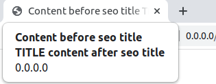

# Simple seo bundle for Pimcore

Seo package that allows you to complete metadata very quickly

## Installation
```
composer require lemonmind/pimcore-simple-seo-bundle
```

in the `config/bundles.php` file add
```php
return [
    // another bundles
    Leogout\Bundle\SeoBundle\LeogoutSeoBundle::class => ['all' => true],
    Lemonmind\PimcoreSimpleSeoBundle\LemonMindPimcoreSimpleSeoBundle::class => ['all' => true],
];
```

in the `config/config.yaml` file add
### Basic configuration
```yaml
leogout_seo:
    general: ~
    basic: ~
    og: ~
    twitter: ~

lemon_mind_pimcore_simple_seo: ~
```

#### Meta image thumbnail
```yaml
lemon_mind_pimcore_simple_seo:
    thumbnail_name: 'simple_thumb_name'
```

#### Title pattern

```yaml
lemon_mind_pimcore_simple_seo:
    title_pattern:
        before: 'Content before seo title'
        after: 'content after seo title'
```


## Usage

in base template add
```html
<head>
    {{ leogout_seo() }}
</head>
```

### Document
Just complete the fields in the SEO section and create (optional) a custom property named **meta_tag_image** with the asset for the document


in `controller` add
```php
public function defaultAction(DocumentSeoMetaGenerator $seoMetaGenerator): Response
{
    $seoMetaGenerator->generate($this->document);

    return $this->render('default/default.html.twig');
}
```

### Object
An interface should be added to the object definition `\Lemonmind\PimcoreSimpleSeoBundle\Model\ObjectSeoInterface`


Then, according to the interface(`\Lemonmind\PimcoreSimpleSeoBundle\Model\ObjectSeoInterface`), create the necessary fields


 
- seoTitle (text->input)
- seoDescription (text->textarea)
- seoKeywords (text->input)
- seoImage (media->image)


in controller
```php
public function seoObjectAction(ObjectSeoMetaGenerator $seoMetaGenerator): Response
{
    /**
     * @var ObjectSeoInterface $test
     */
    $test = Test::getById(1);
    $url = 'absolute url to this object';

    $seoMetaGenerator->generate($test, $url);

    return $this->render('default/default.html.twig');
}
```